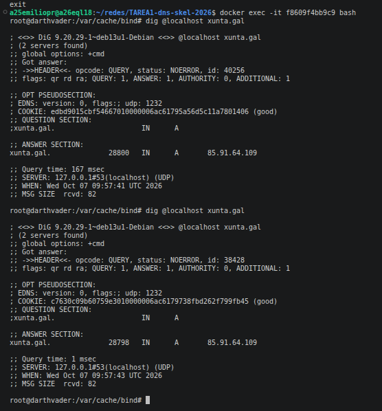
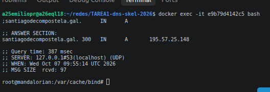
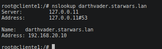
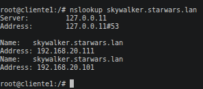
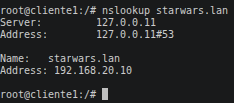
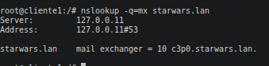
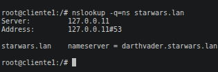
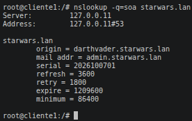
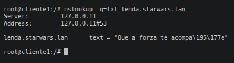
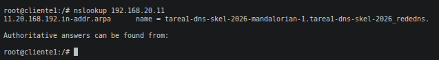

1-

 

2- 

3
 ### db.starwars.lan

$TTL    86400
@       IN      SOA     darthvader.starwars.lan. admin.starwars.lan. (
                        2026100701 ; Número de série (Formato recomendado: YYYYMMDDnn)
                        3600       ; Refresh (1 hora)
                        1800       ; Retry (30 minutos)
                        1209600    ; Expire (2 semanas)
                        86400 )    ; Minimum TTL (1 dia)

; Servidores de nomes (NS)
@       IN      NS      darthvader.starwars.lan.
@       IN      A       192.168.20.10

; Registos A dos servidores
darthvader   IN  A      192.168.20.10
mandalorian  IN  A      192.168.20.11
darthsidious IN  A      192.168.20.11
skywalker    IN  A      192.168.20.101
skywalker    IN  A      192.168.20.111
luke         IN  A      192.168.20.22
yoda         IN  A      192.168.20.24
yoda         IN  A      192.168.20.25
c3p0         IN  A      192.168.20.26

; Alias (CNAME) e Correio (MX)
palpatine    IN  CNAME  darthsidious.starwars.lan.
@            IN  MX 10  c3p0.starwars.lan.

; Registros de texto (TXT)
lenda        IN  TXT    "Que a forza te acompañe"

### named.conf.local

zone "starwars.lan" {
    type master;
    file "/var/cache/bind/db.starwars.lan";
};

zone "20.168.192.in-addr.arpa" {
    type master;
    file "/var/cache/bind/db.192.168.20";
};

4-
### db.192.168.20

$TTL    86400
@       IN      SOA     darthvader.starwars.lan. admin.starwars.lan. (
                        2026100701 ; Serial
                        3600       ; Refresh
                        1800       ; Retry
                        1209600    ; Expire
                        86400 )    ; Minimum TTL

; Servidor de nombres
@       IN      NS      darthvader.starwars.lan.

; Registros PTR (IPs de la red 192.168.20.x)
10      IN      PTR     darthvader.starwars.lan.
11      IN      PTR     mandalorian.starwars.lan.
22      IN      PTR     luke.starwars.lan.
24      IN      PTR     yoda.starwars.lan.
26      IN      PTR     c3p0.starwars.lan.
101     IN      PTR     skywalker.starwars.lan.

5-

